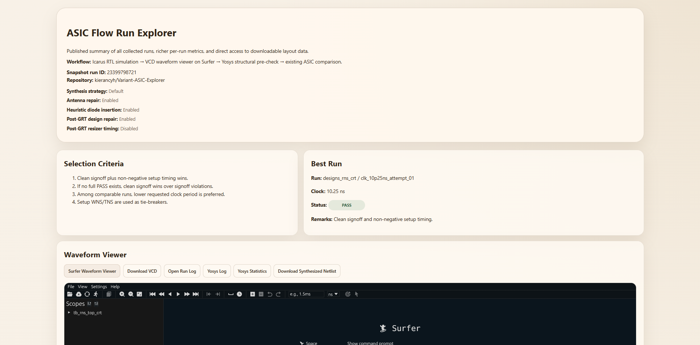
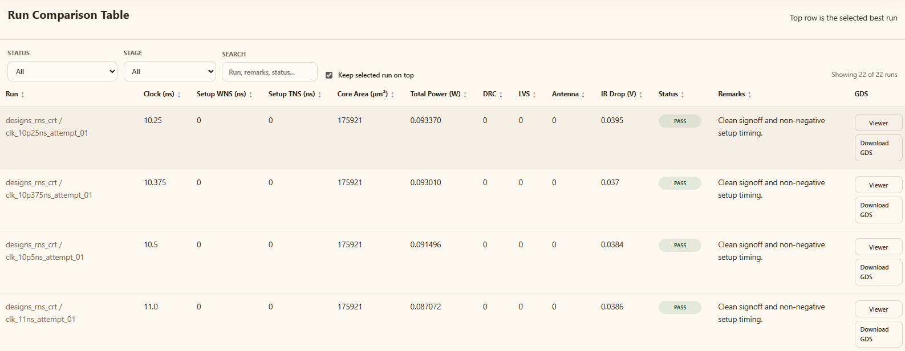
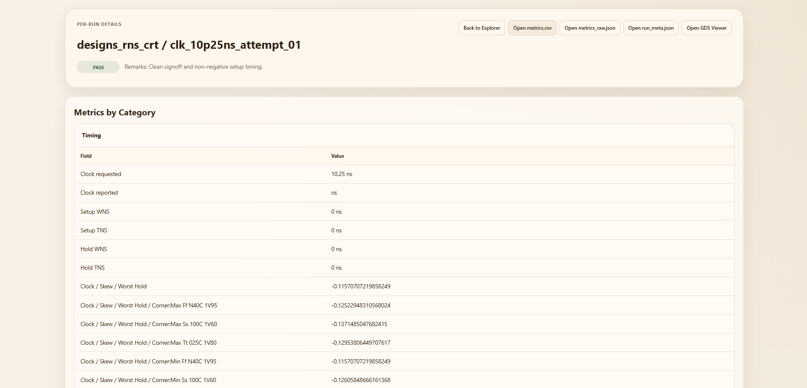
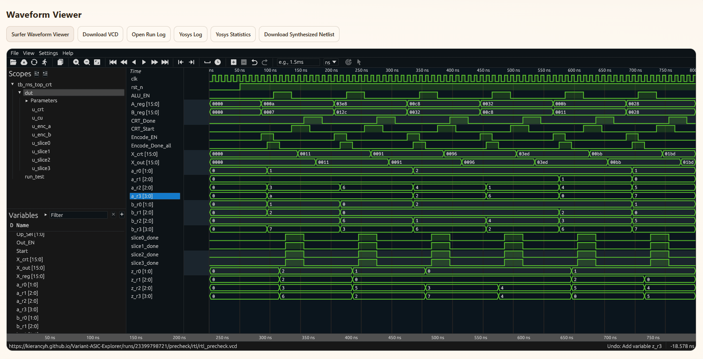
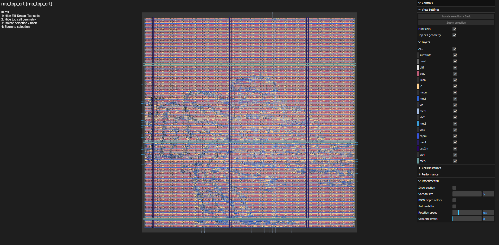

# Variant-ASIC-Explorer

A variant-driven GitHub ASIC flow and Run Explorer for **Sky130 + OpenLane2 / LibreLane**.

This repository is built for **you to upload a verilog(.v) design and the CI flow handles the checking, sweeps, comparison, and publishing**.

---

## What Is This?

`Variant-ASIC-Explorer` is a GitHub-based workflow for running ASIC experiments in a clean, repeatable way, built around **named design variants**.

Each design lives in its own folder under `designs/<variant_name>/`, has its own `variant.yaml`, and is selected through `manifest.yaml`.

From there, the CI runs the following:

- **Icarus RTL precheck**
- **Yosys structural precheck**
- Staged **OpenLane2 / LibreLane timing sweeps**
- Comparisons of the generated runs
- Publishes a lightweight **Run Explorer** through GitHub Pages

---

## TL:DR

The normal user workflow is:

1. Put your ASIC RTL into `src/`
2. Put your testbench files into `tb/`
3. Fill in `variant.yaml`
4. Select the active design in `manifest.yaml`
5. Push to GitHub
6. Let CI do the rest
7. Open the Run Explorer and inspect the results

That is the whole philosophy of the repo.


### A Quick Note on `src/` and `tb/`

This is important.

- `src/` is for **ASIC RTL only**
- `tb/` is for **simulation and testbench files only**

The testbench should **not** contaminate synthesis inputs.
That separation makes the prechecks cleaner and the backend flow much more trustworthy.

---

## Quick Start Guide

### 1. Clone the Repository

```bash
git clone https://github.com/kierancyh/Variant-ASIC-Explorer.git
cd Variant-ASIC-Explorer
```

### 2. Create or Edit a Design Variant

Make a design folder under `designs/`.

Example:

```text
designs/my_variant/
├─ variant.yaml
├─ src/
│  ├─ my_top.v
│  └─ ...
└─ tb/
   └─ tb_my_top.v
```

### 3. Put your Files in the Right Place

- Place your synthesizable RTL in `src/`
- Place your simulation/testbench files in `tb/`

### 4. Fill in `variant.yaml`

A typical variant looks like this:

```yaml
name: my_variant
pdk: sky130A

top_module: my_top

clock:
  port: clk
  mode: auto
  max_ns_cap: 200

sources:
  - src/**/*.v

precheck:
  icarus:
    enabled: true
    testbench_top: tb_my_top
    testbench_sources:
      - tb/**/*.v
      - tb/**/*.sv
    vcd_name: rtl_precheck.vcd
    stop_on_fail: true

  yosys:
    enabled: true
    stop_on_fail: true
    mode: structural
```

### 5. Select the Active Variant in `manifest.yaml`

Example:

```yaml
project:
  title: "Variant ASIC Explorer"
  author: "Kieran"
  notes: "Variant-driven Sky130/OpenLane2 research workflow"

experiments:
  - variant: designs/my_variant
    enabled: true
```

### 6. Push Your Changes

The normal usage model is simply:

```bash
git add .
git commit -m "Add or update design variant"
git push
```

Once pushed, GitHub Actions will run the flow.

---

## What CI does for you

At a high level, the flow is:

```text
plan
-> rtl-precheck
-> yosys-precheck
-> coarse-sweep
-> select-coarse-bracket
-> mid-refine-sweep
-> select-mid-bracket
-> refine-sweep-1
-> select-refine-1
-> refine-sweep-2
-> select-refine-2
-> refine-sweep-3
-> compare-runs
-> deploy-run-explorer
```

### Definitions

- **Plan** resolves the active variant and its metadata
- **RTL precheck** confirms the design and testbench compile and can generate a VCD
- **Yosys precheck** checks that the ASIC RTL is structurally sane from the top-module closure
- **Timing sweeps** explore clock periods from coarse to fine steps
- **Compare-runs** gathers all run artifacts and builds the dashboard
- **Deploy-run-explorer** publishes the lightweight static site

---

## How to use the Run Explorer

After CI completes, open the published Run Explorer from the workflow summary or the GitHub Pages deployment.

The homepage is designed to answer the big questions quickly:

- Which runs passed?
- Which ones failed timing?
- Which ones failed signoff?
- Which run looks best overall?
- Which artifacts are available?

The per-run pages give you more detail, including grouped metrics and useful output links.

### Metric Definitions

- **WNS (ns)** — worst negative slack
- **TNS (ns)** — total negative slack
- **Core Area (μm²)** — physical core area
- **Total Power (W)** — reported total power
- **IR Drop (V)** — voltage drop estimate

---

## Viewing your Waveform

This repo can surface RTL precheck VCDs so you can inspect the waveform more easily.

### External Waveform Viewer

Surfer is a modern waveform viewer that supports browser-based inspection of waveforms, including VCD files.

- **Surfer Web Viewer:** <https://app.surfer-project.org/>

### Simple way to use it

1. Download the generated VCD from the run page or precheck artifact
2. Open the browser app
3. Drop the VCD file into Surfer
4. Inspect signals, timing, and transitions

If your deployed Run Explorer already links the waveform directly, you can use that shortcut instead.

---

## Viewing your GDS

This repo does **not** use the Tiny Tapeout harden flow.
It only uses the external Tiny Tapeout viewer as a convenient way to inspect a generated GDS in the browser.

### External GDS viewer

- **Tiny Tapeout GDS Viewer:** <https://gds-viewer.tinytapeout.com/>

### How to use it

1. Download the GDS from the run page or artifact
2. Open the Tiny Tapeout GDS Viewer
3. Drag and drop the GDS file into the page
4. Use the viewer controls to inspect geometry and hierarchy

If the Run Explorer shows a **Viewer** button for GDS, that is the quickest route.

---

## Further Reading

For the full technical explanation of the workflow, architecture, artifact model, and timing refinement logic, see:

- [`TECHNICAL DOCUMENTATION.md`](./TECHNICAL%20DOCUMENTATION.md)

---

## Screenshots

### 1. Run Explorer Homepage
A high-level summary of the selected run, including the chosen best result, key metrics, and quick access to waveform and GDS viewing tools.



---

### 2. Run Comparison Table
The comparison view for all generated runs, showing timing, area, power, IR drop, status, remarks, and GDS actions in one place.



---

### 3. Per-Run Page
The detailed page for a single run, including grouped metadata, stage information, metrics, downloads, and run-specific outputs.



---

### 4. Waveform Viewer
The embedded waveform section used to inspect RTL simulation output and VCD behaviour through the external Surfer workflow.



---

### 5. TinyTapeout GDS Viewer
The external GDS viewing workflow used for layout inspection when a generated GDS is available.



---
